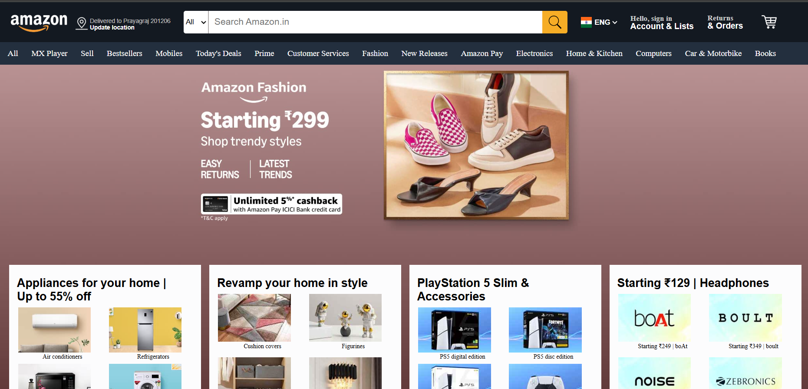

# 🛒 Amazon UI Clone (HTML + CSS)

A pixel-perfect static clone of Amazon's homepage interface built with pure **HTML** and **CSS** - no JavaScript or frameworks used.

## 🌟 Features
- **100% Pure Frontend**: No JavaScript or backend code  
- **Responsive Design**: Works on mobile, tablet and desktop  
- **Semantic HTML**: Properly structured content  
- **Modern CSS**: Flexbox, Grid and CSS variables  
- **Performance Optimized**: Lightweight and fast-loading  

## 🛠️ Tech Stack
- **HTML5** semantic markup  
- **CSS3** (Flexbox, Grid, Variables)  
- **No frameworks** (no Bootstrap/Tailwind)  
- **No JavaScript** (pure CSS interactions)  

## 🖥️ How to View
Simply open the `index.html` file in any modern browser. No build step or dependencies required.

## 📂 File Structure

## 🎯 What I Achieved
✔️ **Accurate Amazon UI** replication using only CSS  
✔️ **Complex navigation bar** with pure CSS dropdowns  
✔️ **Responsive product grids** using CSS Flexbox/Grid  
✔️ **Hover effects** and interactive elements without JS  
✔️ **Cross-browser compatible** design  

## 🙋‍♂️ About the Developer
**Created by Vivek Patel**  

📧 **Email**: [vivekpatel1234a@gmail.com](mailto:vivekpatel1234a@gmail.com)  
🔗 **GitHub**: [github.com/vivekpatel1234a](https://github.com/vivekpatel1234a)  

This project demonstrates my strong understanding of:
- Semantic HTML structure
- Advanced CSS techniques
- Responsive design principles
- Attention to UI details